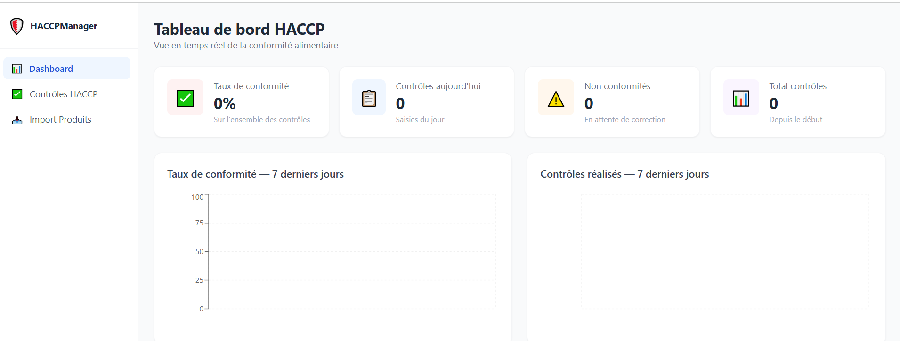
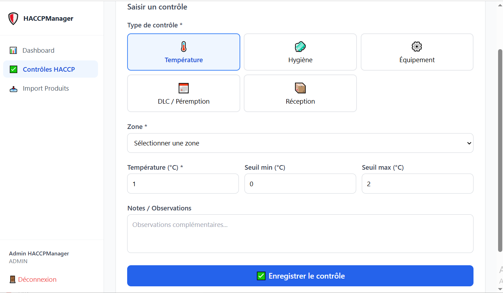
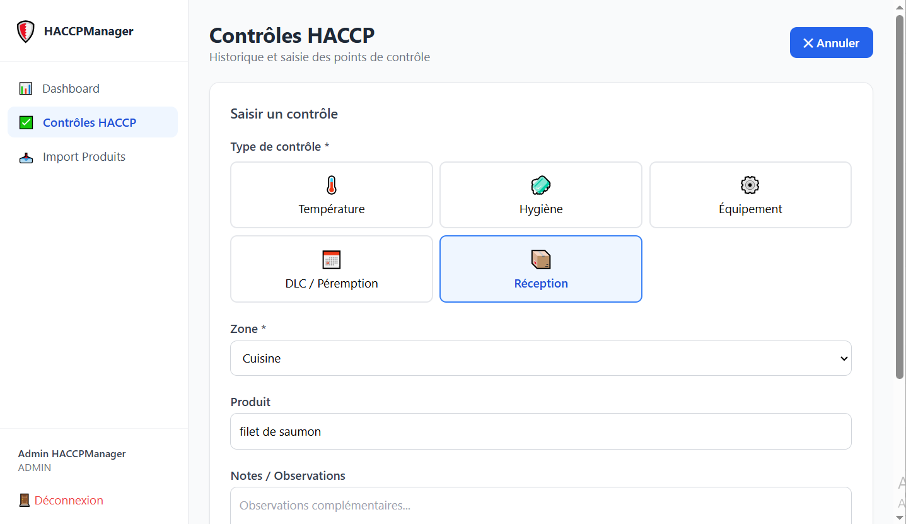
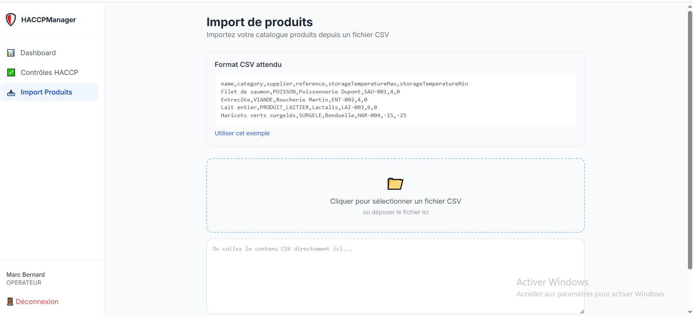
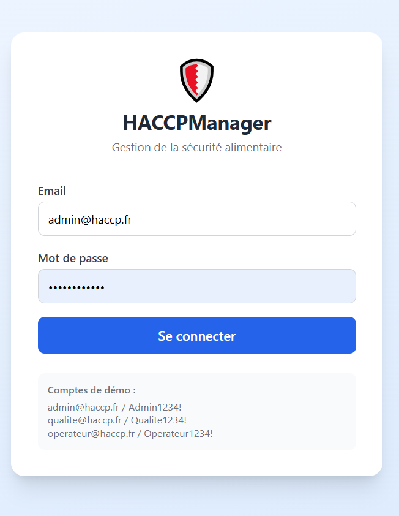
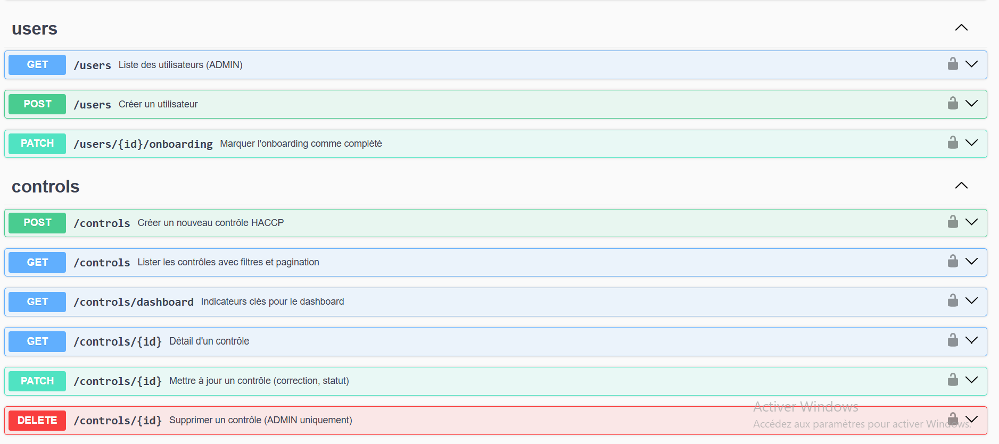
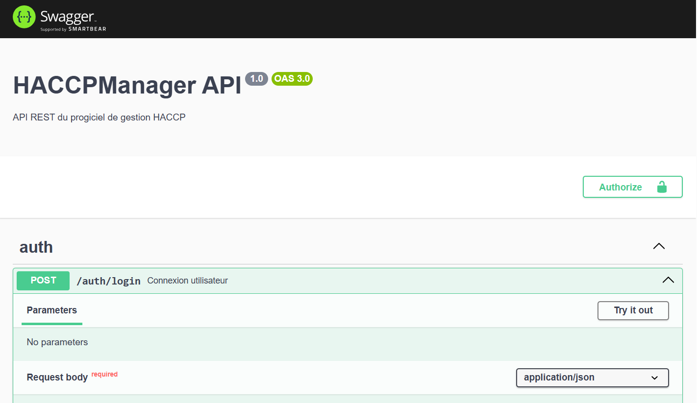

# 🛡️ HACCPManager

> **Progiciel de gestion de la sécurité alimentaire** — Contrôles qualité HACCP, traçabilité des produits, alertes de non-conformité et rapports PDF automatisés pour les professionnels du secteur agro-alimentaire.

<div align="center">

[](https://haccp-manager-frontend.onrender.com)
[](https://haccp-manager-kle5.onrender.com/api)
[](https://github.com)
[](LICENSE)

</div>

---

## 🌐 Démo en ligne

| Service                | URL                                                                                |
| ---------------------- | ---------------------------------------------------------------------------------- |
| **Frontend**           | [haccp-manager-frontend.onrender.com](https://haccp-manager-frontend.onrender.com) |
| **API REST + Swagger** | [haccp-manager-kle5.onrender.com/api](https://haccp-manager-kle5.onrender.com/api) |

### Comptes de démonstration

| Rôle                   | Email              | Mot de passe   |
| ---------------------- | ------------------ | -------------- |
| 👑 Administrateur      | admin@haccp.fr     | Admin1234!     |
| 🔍 Responsable qualité | qualite@haccp.fr   | Qualite1234!   |
| 👷 Opérateur           | operateur@haccp.fr | Operateur1234! |

---

## 📸 Captures d'écran

### Tableau de bord — KPIs & conformité temps réel



### Tableau de bord employé


### Contrôles HACCP



### Contrôles HACCP — Réception



### Import de produits (CSV)



### Page de connexion



### Gestion des utilisateurs & contrôles (API)



### Documentation API Swagger



---

## 🎯 Contexte du projet

HACCPManager simule un progiciel métier complet tel que ceux édités par des sociétés spécialisées en FoodTech (ex : Keyfood-HACCP, DBF Qualité). Il couvre l'ensemble du cycle de vie d'un projet informatique :

- **Conception** : architecture technique, modélisation BDD, API REST
- **Développement** : frontend React/TypeScript + backend NestJS
- **Déploiement** : Docker, CI/CD GitHub Actions, hébergement cloud (Render)
- **Maintenance évolutive** : versioning Git, tests Jest, documentation Swagger
- **Support utilisateur** : onboarding interactif, import CSV, rapports PDF

---

## ✨ Fonctionnalités

### ✅ Contrôles HACCP

- Saisie guidée des points de contrôle critiques (CCP) : température, hygiène, équipements, DLC, réception
- Détection automatique des non-conformités selon les seuils configurés
- Historique complet filtrable par type, zone, statut et date
- Statuts : `CONFORME` / `NON_CONFORME` / `EN_ATTENTE` / `CORRIGÉ`

### 📊 Dashboard temps réel

- Taux de conformité global et sur 7 jours
- Alertes actives (non-conformités en attente de correction)
- Nombre de contrôles du jour
- Graphiques interactifs (Recharts)

### 📦 Gestion des produits & traçabilité

- Référentiel produits avec catégories, fournisseurs, DLC/DLUO
- Gestion des lots avec traçabilité complète
- Alertes automatiques pour les lots expirant dans les 3 jours
- **Import en masse depuis fichier CSV** avec rapport d'erreurs ligne par ligne

### 📄 Rapports PDF

- Génération automatique de rapports de conformité journaliers
- Horodatage et archivage
- Téléchargement direct depuis l'interface

### 👥 Gestion des utilisateurs & rôles

- 3 niveaux d'accès : `ADMIN`, `QUALITE`, `OPERATEUR`
- Authentification JWT avec refresh token
- Onboarding interactif au premier login (tutoriel pas-à-pas)

### ⚙️ Administration

- Configuration des équipements et zones de contrôle
- Intégration et paramétrage des données clients
- Back-office dédié aux administrateurs

---

## 🏗️ Architecture technique

```
HACCPManager/
├── backend/                  # API REST — NestJS + TypeORM + PostgreSQL
│   ├── src/
│   │   ├── auth/             # JWT, refresh tokens, Passport.js
│   │   ├── users/            # Gestion utilisateurs & rôles (RBAC)
│   │   ├── controls/         # Contrôles HACCP (CCP)
│   │   ├── products/         # Produits, lots, import CSV
│   │   ├── reports/          # Génération PDF, dashboard stats
│   │   └── common/           # Guards, decorators, filters
│   └── test/                 # Tests unitaires Jest
│
├── frontend/                 # SPA React + TypeScript + Tailwind CSS
│   └── src/
│       ├── components/       # Layout, formulaires, UI réutilisable
│       ├── pages/            # Dashboard, Contrôles, Import, Auth
│       ├── hooks/            # useAuth, custom hooks
│       └── services/         # Couche API axios avec intercepteurs JWT
│
├── docker-compose.yml        # Stack complète en un seul lancement
└── .github/workflows/ci.yml  # Pipeline CI/CD automatisé
```

---

## ⚙️ Stack technique

| Couche              | Technologie                                                     |
| ------------------- | --------------------------------------------------------------- |
| **Frontend**        | React 18, TypeScript, Vite, Tailwind CSS, React Query, Recharts |
| **Backend**         | NestJS, TypeORM, Passport.js, JWT Auth, class-validator         |
| **Base de données** | PostgreSQL 15                                                   |
| **PDF**             | PDFKit                                                          |
| **Tests**           | Jest, Supertest                                                 |
| **DevOps**          | Docker, Docker Compose, GitHub Actions CI/CD                    |
| **Déploiement**     | Render (backend + frontend)                                     |

---

## 🚀 Lancement local (Docker)

```bash
# 1. Cloner le projet
git clone https://github.com/mekid-asmaa-hayat/haccpmanager.git
cd HACCPManager

# 2. Variables d'environnement
cp backend/.env.example backend/.env
cp frontend/.env.example frontend/.env

# 3. Lancer la base de données
docker-compose up db -d

# 4. Backend (nouveau terminal)
cd backend && npm install && npm run start:dev

# 5. Frontend (nouveau terminal)
cd frontend && npm install && npm run dev

# ✅ Frontend  → http://localhost:3000
# ✅ API       → http://localhost:4000
# ✅ Swagger   → http://localhost:4000/api
```

---

## 🔄 CI/CD Pipeline

Le pipeline GitHub Actions s'exécute automatiquement à chaque push sur `main` :

```
Push → Lint → Build TypeScript → Tests Jest → Docker Build → Deploy Render
```

---

## 📡 API REST — Endpoints principaux

| Méthode | Route                 | Description                                |
| ------- | --------------------- | ------------------------------------------ |
| `POST`  | `/auth/login`         | Connexion, retourne JWT                    |
| `POST`  | `/auth/refresh`       | Rafraîchir le token                        |
| `GET`   | `/controls`           | Liste des contrôles (filtres + pagination) |
| `POST`  | `/controls`           | Créer un contrôle HACCP                    |
| `PATCH` | `/controls/:id`       | Mettre à jour / corriger                   |
| `GET`   | `/controls/dashboard` | KPIs dashboard                             |
| `GET`   | `/products`           | Liste des produits                         |
| `POST`  | `/products/import`    | Import CSV en masse                        |
| `GET`   | `/reports/daily`      | Rapport journalier PDF                     |
| `GET`   | `/reports/dashboard`  | Statistiques de conformité                 |
| `GET`   | `/users`              | Liste utilisateurs (ADMIN)                 |

Documentation complète interactive : [Swagger UI](https://haccp-manager-kle5.onrender.com/api)

---

## 🧪 Tests

```bash
cd backend

# Tests unitaires
npm run test

# Tests avec couverture
npm run test -- --coverage
```

---

## 👩‍💻 Auteure

**Mekid Asma Hayet** — Développeuse Full Stack

[](https://mekid-portfolio.web.app)
[](https://linkedin.com/in/mekid-asma-hayet-014850222)
[](https://github.com/mekid-asmaa-hayat)

---

<div align="center">
  <sub>Projet portfolio — Développé avec ❤️ pour démontrer les compétences en développement Full Stack, déploiement et gestion de progiciel métier.</sub>
</div>
